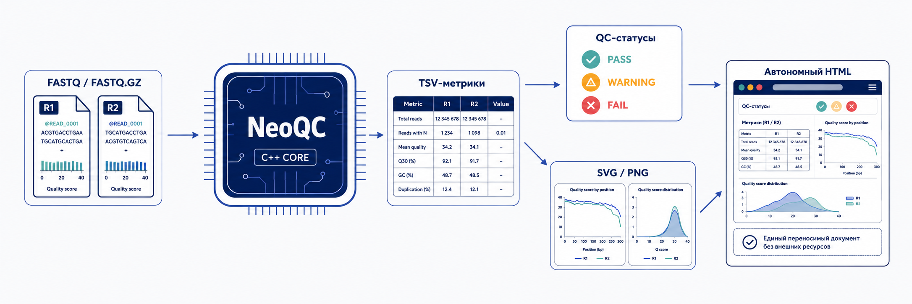

# NeoQC

**Быстрый и воспроизводимый контроль качества FASTQ-данных.**

NeoQC проверяет структуру файлов секвенирования, рассчитывает основные метрики
качества и формирует автономный HTML-отчёт для single-end и paired-end библиотек.
Вычислительное ядро написано на C++20; визуализация и интерпретируемые статусы
`PASS / WARNING / FAIL` формируются Python-модулем по версионированному набору правил.

<p align="center">
  
</p>

## Возможности

- чтение `FASTQ`, `.fastq.gz`, single-end и paired-end данных;
- строгая проверка структуры записей и синхронизации R1/R2;
- базовая статистика, длины ридов, GC, N и состав A/C/G/T по позициям;
- качество по позициям, квартили и распределение среднего Phred по ридам;
- точный подсчёт дупликации 50-nt префиксов и overrepresented sequences;
- поиск адаптерных последовательностей для R1 и R2;
- техническая оценка метрик с объяснимыми статусами QC;
- SVG/PNG-графики и переносимый HTML-отчёт без внешних ресурсов;
- пакетный анализ образцов по CSV с итоговой сводкой случая.

## Требования и сборка

Необходимы CMake 3.22+, компилятор с поддержкой C++20 и zlib. Для графиков и
HTML-отчёта дополнительно требуются Python 3 и Matplotlib.

```bash
./build.sh
```

После release-сборки исполняемый файл доступен как `./build/neoqc`.

## Быстрый старт

Paired-end анализ с полным QC-отчётом:

```bash
./build/neoqc \
  --r1 sample_R1.fastq.gz \
  --r2 sample_R2.fastq.gz \
  --sample-id sample01 \
  --out results/sample01 \
  --plot
```

Single-end анализ:

```bash
./build/neoqc \
  --r1 sample.fastq.gz \
  --sample-id sample01 \
  --out results/sample01 \
  --plot
```

Готовый отчёт открывается напрямую в браузере:

```text
results/sample01/neoqc_qc_report.html
```

## Пакетный анализ

Формат таблицы образцов показан в [`examples/samples.csv`](examples/samples.csv).

```bash
# Проверить таблицу без анализа FASTQ
./build/neoqc --samples examples/samples.csv

# Выполнить QC всех перечисленных библиотек
./build/neoqc --samples examples/samples.csv --out results --plot
```

Результаты сохраняются в `<out>/<patient_id>/<sample_id>/`, а для каждого случая
создаётся машинно-читаемая сводка `case_summary.json`.

## Интерфейс командной строки

| Параметр | Назначение |
|---|---|
| `--r1 <file>` | FASTQ-файл R1; обязательный для одиночного запуска. |
| `--r2 <file>` | FASTQ-файл R2 для paired-end анализа. |
| `--sample-id <id>` | Идентификатор образца. |
| `--out <dir>` | Каталог результатов. |
| `--samples <csv>` | Проверка или пакетная обработка таблицы образцов. |
| `--plot` | Построение графиков, QC-оценки и HTML-отчёта. |
| `--skip-adapters` | Отключение поиска адаптеров. |
| `--timings` | Вывод времени выполнения этапов. |
| `--help`, `-h` | Краткая справка. |

## Результаты

NeoQC сохраняет исходные наблюдения отдельно от их оценки:

```text
results/sample01/
├── sample01_R1_summary.txt
├── sample01_R2_summary.txt
├── per_cycle_R1.tsv
├── per_sequence_quality_R1.tsv
├── per_base_sequence_content_R1.tsv
├── per_sequence_gc_content_R1.tsv
├── per_base_n_content_R1.tsv
├── sequence_length_distribution_R1.tsv
├── sequence_duplication_levels_R1.tsv
├── sequence_duplication_summary_R1.tsv
├── overrepresented_sequences_R1.tsv
├── adapter_content_R1.tsv
├── qc_evaluation.json
├── neoqc_qc_report.html
└── plots/
    ├── plots_manifest.json
    ├── *.svg
    └── *.png
```

Для paired-end библиотек создаётся соответствующий набор файлов R2. HTML является
автономным: графики, стили и шрифты встроены в документ, поэтому его можно открыть
на другом компьютере без установки NeoQC и без доступа к интернету.

Статусы QC рассчитываются отдельно от состояния графика. Ошибка визуализации не
становится биологическим `FAIL`, а отсутствие данных не интерпретируется как `PASS`.
Активный профиль правил записывается в `qc_evaluation.json`, что обеспечивает
проверяемость и воспроизводимость решения.

## Ограничения

- вычислительное ядро текущей версии работает в одном потоке;
- точный расчёт дупликации хранит все уникальные 50-нуклеотидные префиксы;
  потребление памяти поэтому зависит от сложности и размера библиотеки;
- NeoQC не выполняет trimming, выравнивание и поиск вариантов;
- технические статусы QC требуют интерпретации с учётом типа библиотеки и не
  являются клиническим заключением.

## Проверка сборки

```bash
ctest --test-dir build --output-on-failure
```

Подробности интеграции: [расчёт дупликации](docs/sequence-duplication.md),
[контракт графиков](docs/plots.md),
[движок QC-статусов](docs/qc-status-engine.md) и
[полный отчёт neo-mRNA-vax](docs/html-report.md).

NeoQC развивается как самостоятельный инструмент первичного контроля данных NGS
и используется в составе платформы **neo-mRNA-vax**.
